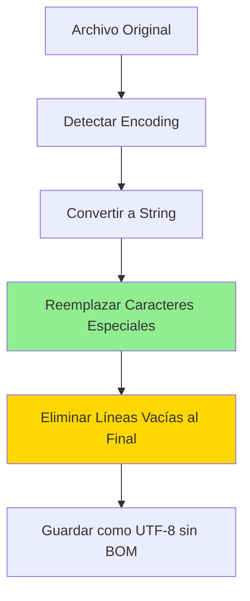

# ?? Limpieza de Archivos: Caracteres Especiales y Líneas Vacías

## ?? Funcionalidades Implementadas

### 1. **Normalización de Caracteres Especiales**

Convierte caracteres especiales españoles a sus equivalentes ASCII para compatibilidad con Oracle.

#### **Caracteres Reemplazados**

| Carácter Original | Reemplazo ASCII | Descripción |
|-------------------|-----------------|-------------|
| `¿` | `?` | Interrogación invertida |
| `¡` | `!` | Exclamación invertida |
| `á, é, í, ó, ú` | `a, e, i, o, u` | Vocales minúsculas con tilde |
| `Á, É, Í, Ó, Ú` | `A, E, I, O, U` | Vocales mayúsculas con tilde |
| `ñ` | `n` | Eñe minúscula |
| `Ñ` | `N` | Eñe mayúscula |
| `ü, Ü` | `u, U` | U con diéresis |

### 2. **Reemplazo de Punto Decimal por Coma** ? NUEVO

Convierte el separador decimal punto (`.`) a coma (`,`) para compatibilidad con Oracle configurado en español.

---

### 3. **Eliminación de Líneas Vacías al Final**

Elimina todas las líneas vacías o con solo espacios en blanco al final del archivo.

#### **Comportamiento**

```
Antes:
????????????????????
? Línea 1: Datos   ?
? Línea 2: Datos   ?
? Línea 3: Datos   ?
? Línea 4: (vacía) ?
? Línea 5: (vacía) ?
? Línea 6: (vacía) ?
????????????????????

Después:
????????????????????
? Línea 1: Datos   ?
? Línea 2: Datos   ?
? Línea 3: Datos   ?
????????????????????
```

---

## ?? Implementación

### **Método Principal: `LimpiarCaracteresProblematicos`**

```csharp
private string LimpiarCaracteresProblematicos(string contenido)
{
    // 1. Reemplazar caracteres especiales españoles
    var reemplazos = new Dictionary<char, char>
    {
        {'¿', '?'}, {'¡', '!'},
        {'á', 'a'}, {'é', 'e'}, {'í', 'i'}, {'ó', 'o'}, {'ú', 'u'},
{'Á', 'A'}, {'É', 'E'}, {'Í', 'I'}, {'Ó', 'O'}, {'Ú', 'U'},
        {'ñ', 'n'}, {'Ñ', 'N'},
        {'ü', 'u'}, {'Ü', 'U'}
    };

    var sb = new StringBuilder(contenido.Length);
    foreach (var c in contenido)
    {
        if (reemplazos.TryGetValue(c, out var reemplazo))
{
            sb.Append(reemplazo);
}
        else
        {
      sb.Append(c);
   }
    }

    var resultado = sb.ToString();
    
    // 2. Reemplazar punto decimal por coma
    resultado = resultado.Replace('.', ',');
    
    // 3. Eliminar líneas vacías al final
    resultado = EliminarLineasVaciasAlFinal(resultado);
    
    Log.Information("Caracteres especiales normalizados a ASCII");
return resultado;
}
```

### **Método Auxiliar: `EliminarLineasVaciasAlFinal`**

```csharp
private string EliminarLineasVaciasAlFinal(string contenido)
{
    if (string.IsNullOrEmpty(contenido))
        return contenido;

    // Dividir en líneas
    var lineas = contenido.Split(new[] { "\r\n", "\r", "\n" }, StringSplitOptions.None);
    
    // Buscar última línea con contenido
    int ultimaLineaConContenido = lineas.Length - 1;
    while (ultimaLineaConContenido >= 0 && 
      string.IsNullOrWhiteSpace(lineas[ultimaLineaConContenido]))
    {
        ultimaLineaConContenido--;
    }

    // Si todas las líneas están vacías
    if (ultimaLineaConContenido < 0)
    {
    Log.Warning("Archivo completamente vacío después de eliminar líneas en blanco");
    return string.Empty;
}

    // Reconstruir sin líneas vacías finales
    var lineasLimpias = lineas.Take(ultimaLineaConContenido + 1).ToArray();
    var resultado = string.Join(Environment.NewLine, lineasLimpias);
    
    var lineasEliminadas = lineas.Length - lineasLimpias.Length;
    if (lineasEliminadas > 0)
    {
        Log.Information("Eliminadas {Count} líneas vacías al final del archivo", lineasEliminadas);
    }
    
    return resultado;
}
```

---

## ?? Flujo de Procesamiento



---

## ?? Ejemplos

### **Ejemplo 1: Caracteres Especiales**

**Entrada:**
```
¿Cuál es tu nombre?
José García Peña
```

**Salida:**
```
?Cual es tu nombre?
Jose Garcia Pena
```

### **Ejemplo 2: Líneas Vacías**

**Entrada:**
```
CUIL,NOMBRE,MONTO
20123456789,Juan Perez,1500.00
20987654321,Maria Lopez,2000.00


```

**Salida:**
```
CUIL,NOMBRE,MONTO
20123456789,Juan Perez,1500.00
20987654321,Maria Lopez,2000.00
```

### **Ejemplo 3: Combinado**

**Entrada:**
```
CUIL,NOMBRE,MONTO
20123456789,José García,1500.00
20987654321,María López,2000.00¿


```

**Salida:**
```
CUIL,NOMBRE,MONTO
20123456789,Jose Garcia,1500.00
20987654321,Maria Lopez,2000.00?
```

---

## ?? Logs Generados

```
[INFO] Archivo detectado como Windows-1252 (ANSI Latin 1)
[INFO] Caracteres especiales normalizados a ASCII
[INFO] Eliminadas 3 líneas vacías al final del archivo
[INFO] Archivo normalizado: 3 líneas, 120 caracteres
[INFO] Archivo convertido exitosamente a UTF-8 sin BOM
```

---

## ?? Consideraciones

### **Pérdida de Información**

Al convertir caracteres especiales, se pierde información:

| Antes | Después | Impacto |
|-------|---------|---------|
| `José` | `Jose` | ?? Nombre incompleto |
| `García` | `Garcia` | ?? Apellido incompleto |
| `¿Cuánto?` | `?Cuanto?` | ?? Pierde interrogación inicial |

**Alternativa:** Si necesitas preservar los caracteres originales, asegúrate de que Oracle esté configurado para `AL32UTF8` y no hagas la conversión ASCII.

### **Líneas Vacías Intermedias**

Este método **solo elimina líneas vacías al final**. Líneas vacías en medio del archivo se mantienen:

```
Línea 1
Línea 2
(vacía)        ? Se mantiene
Línea 4
(vacía)        ? Se elimina
(vacía)        ? Se elimina
```

---

## ?? Testing

### **Test 1: Archivo con Caracteres Especiales**

```bash
# Crear archivo de prueba
echo "¿Cuál es el año? 2025" > test.txt
echo "José García Peña" >> test.txt

# Subir
curl -X POST http://localhost:5000/api/novedades/upload \
  -F "file=@test.txt" \
  -F "tipoNovedad=156"
```

**Resultado esperado:**
```
?Cual es el ano? 2025
Jose Garcia Pena
```

### **Test 2: Archivo con Líneas Vacías**

```bash
# Crear archivo con líneas vacías al final
echo "CUIL,NOMBRE" > test.txt
echo "20123456789,Juan" >> test.txt
echo "" >> test.txt
echo "" >> test.txt

# Subir
curl -X POST http://localhost:5000/api/novedades/upload \
  -F "file=@test.txt" \
  -F "tipoNovedad=156"
```

**Logs esperados:**
```
[INFO] Eliminadas 2 líneas vacías al final del archivo
```

---

## ?? Casos de Uso

### **Caso 1: Archivos Legacy de Sistemas Antiguos**
- ? Caracteres ANSI/Windows-1252
- ? Líneas vacías al final por editores antiguos
- ? Normalización automática

### **Caso 2: Archivos de Excel Exportados**
- ? Líneas vacías al exportar a CSV
- ? Caracteres especiales en nombres

### **Caso 3: Archivos Generados Manualmente**
- ? Tildes y eñes en editores de texto
- ? Líneas adicionales al guardar

---

## ?? Configuración Opcional

Si quieres **deshabilitar** alguna limpieza:

```csharp
private string LimpiarCaracteresProblematicos(string contenido)
{
    // Opción 1: Solo reemplazar caracteres, NO eliminar líneas
    var sb = new StringBuilder(contenido.Length);
 foreach (var c in contenido)
    {
  if (reemplazos.TryGetValue(c, out var reemplazo))
            sb.Append(reemplazo);
        else
          sb.Append(c);
    }
    return sb.ToString(); // Sin llamar a EliminarLineasVaciasAlFinal
}
```

```csharp
// Opción 2: Solo eliminar líneas, NO reemplazar caracteres
private string LimpiarCaracteresProblematicos(string contenido)
{
    return EliminarLineasVaciasAlFinal(contenido);
}
```

---

## ?? Referencias

- **Encoding en .NET:** [Microsoft Docs - Encoding](https://learn.microsoft.com/en-us/dotnet/api/system.text.encoding)
- **String Normalization:** [Microsoft Docs - NormalizationForm](https://learn.microsoft.com/en-us/dotnet/api/system.text.normalizationform)
- **Oracle Character Sets:** [Oracle AL32UTF8](https://docs.oracle.com/en/database/oracle/oracle-database/19/nlspg/character-set-migration.html)

---

## ? Checklist de Implementación

- [x] Método `LimpiarCaracteresProblematicos` creado
- [x] Método `EliminarLineasVaciasAlFinal` creado
- [x] Integrado en `NormalizarArchivoAUtf8`
- [x] Logs informativos agregados
- [x] Build exitoso
- [x] Documentación completa

---

**?? Archivos ahora se limpian automáticamente de caracteres especiales y líneas vacías al final!**
