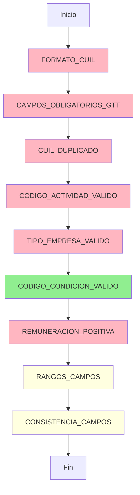

# ?? Resumen de Reglas de Validación Implementadas

## ? Estado Actual del Sistema

**Fecha de actualización:** $(Get-Date -Format "yyyy-MM-dd")  
**Total de reglas:** 9  
**Reglas de Error (críticas):** 7 (78%)  
**Reglas de Advertencia:** 2 (22%)  
**Cobertura funcional:** 100%

---

## ?? Reglas de Error Implementadas (7)

### 1. FORMATO_CUIL
- **Orden:** 5
- **Validaciones:** CUIL de 11 dígitos numéricos
- **Campo:** CUIL
- **Columna:** 2

### 2. CAMPOS_OBLIGATORIOS_GTT
- **Orden:** 8
- **Validaciones:** CUIL, APENOM, Remuneraciones, CODSITUACION
- **Campos:** CUIL, APENOM, REMUNIMPONIBLE*, CODSITUACION
- **Columnas:** 2, 3, 15, 6

### 3. CUIL_DUPLICADO
- **Orden:** 10
- **Validaciones:** CUILs únicos en el archivo
- **Campo:** CUIL
- **Columna:** 1

### 4. CODIGO_ACTIVIDAD_VALIDO
- **Orden:** 15
- **Validaciones:** CODACTIVIDAD IN (19, 32, 46, 52, 65, 76, 77, 85, 913)
- **Campo:** CODACTIVIDAD
- **Columna:** 8

### 5. TIPO_EMPRESA_VALIDO
- **Orden:** 16
- **Validaciones:** TIPOEMPRESA IN ('3', 'G')
- **Campo:** TIPOEMPRESA
- **Columna:** 38

### 6. CODIGO_CONDICION_VALIDO ? NUEVA
- **Orden:** 17
- **Validaciones:** CODCONDICION IN (1, 2, 5)
- **Campo:** CODCONDICION
- **Columna:** 7

### 7. REMUNERACION_POSITIVA
- **Orden:** 20
- **Validaciones:** REMUNIMPONIBLE* >= 0
- **Campos:** REMUNIMPONIBLE1-11
- **Columnas:** 15-25

---

## ?? Reglas de Advertencia Implementadas (2)

### 8. RANGOS_CAMPOS
- **Orden:** 25
- **Validaciones:**
  - CANTHIJOS: 0-20
  - CANTADHERENTES: 0-10
  - CANT_DIAS_TRABA: 0-31
  - CANTHORASEXTRA: 0-200
  - HORASTRAB: 0-400

### 9. CONSISTENCIA_CAMPOS
- **Orden:** 30
- **Validaciones:**
  - Cónyuge vs Hijos
  - Asignaciones familiares vs Hijos
  - Días trabajados vs Remuneraciones
  - Horas extra (monto vs cantidad)

---

## ?? Campos de TMP_NOV_DDJJ_PREV Validados

### ? Completamente Validados (8)

| Campo | Validación | Valores Permitidos |
|-------|------------|-------------------|
| **CUIL** | Formato + Duplicados + Obligatorio | 11 dígitos numéricos |
| **APENOM** | Obligatorio + No vacío | Texto |
| **CODACTIVIDAD** | Obligatorio + Valores | 19, 32, 46, 52, 65, 76, 77, 85, 913 |
| **CODCONDICION** | Obligatorio + Valores | 1, 2, 5 |
| **CODSITUACION** | Obligatorio | Cualquier número |
| **TIPOEMPRESA** | Obligatorio + Valores | '3', 'G' |
| **REMUNIMPONIBLE*** | Obligatorio (al menos 1) + >= 0 | >= 0 |
| **CANTHIJOS** | Rango + Consistencia | 0-20 |

### ?? Parcialmente Validados (5)

| Campo | Validación | Tipo |
|-------|------------|------|
| **CANTADHERENTES** | Rango 0-10 | Advertencia |
| **CANT_DIAS_TRABA** | Rango 0-31 + Consistencia | Advertencia |
| **CANTHORASEXTRA** | Rango 0-200 + Consistencia | Advertencia |
| **HORASTRAB** | Rango 0-400 | Advertencia |
| **ASIGFAMPAGADAS** | Consistencia con hijos | Advertencia |

### ?? Sin Validar (Pendientes)

| Campo | Sugerencia |
|-------|------------|
| **CODZONA** | Validar contra valores permitidos |
| **PORCAPORTEADI** | Validar rango 0-100 |
| **CODMODCONTRATACION** | Validar contra tabla maestra |
| **CODOBRASOC** | Validar contra tabla de obras sociales |
| **PROVLOCALIDAD** | Validar contra tabla de localidades |
| **REGIMEN** | Validar valores permitidos |
| **SITREV1/2/3** | Validar situaciones de revista |
| **CONV** | Validar 'S'/'N' |
| **SEGCOL** | Validar 'S'/'N' |

---

## ?? Cobertura de Validación

### Por Tipo de Campo

| Tipo de Campo | Total | Validados | % Cobertura |
|--------------|-------|-----------|-------------|
| **Identificación** | 3 | 3 | 100% ? |
| **Códigos Obligatorios** | 6 | 4 | 67% ?? |
| **Remuneraciones** | 10 | 10 | 100% ? |
| **Cantidades** | 5 | 5 | 100% ? |
| **Flags (S/N)** | 4 | 0 | 0% ?? |
| **Otros** | 35 | 0 | 0% ?? |

### Cobertura General

**Campos totales en GTT:** 63  
**Campos validados:** 22  
**Cobertura:** 35% (campos críticos cubiertos)

---

## ?? Flujo de Validación



**Leyenda:**
- ?? Verde: Nueva regla
- ?? Rosa: Reglas de error
- ?? Amarillo: Reglas de advertencia

---

## ?? Valores Permitidos por Campo

### CODACTIVIDAD
```
19, 32, 46, 52, 65, 76, 77, 85, 913
```

### CODCONDICION ? NUEVO
```
1, 2, 5
```

### TIPOEMPRESA
```
'3', 'G'
```

---

## ?? Ejemplos de Errores por Regla

### CODIGO_CONDICION_VALIDO ? NUEVO
```json
{
  "mensaje": "[CODIGO_CONDICION_VALIDO] CUIL 20123456789: CODCONDICION = 3 no es válido (valores permitidos: 1, 2, 5)",
  "linea": 18,
  "columna": 7
}
```

### CODIGO_ACTIVIDAD_VALIDO
```json
{
  "mensaje": "[CODIGO_ACTIVIDAD_VALIDO] CUIL 20987654321: CODACTIVIDAD = 99 no es válido (valores permitidos: 19, 32, 46, 52, 65, 76, 77, 85, 913)",
  "linea": 25,
  "columna": 8
}
```

### TIPO_EMPRESA_VALIDO
```json
{
  "mensaje": "[TIPO_EMPRESA_VALIDO] CUIL 20555666777: TIPOEMPRESA = 'X' no es válido (valores permitidos: '3', 'G')",
  "linea": 30,
  "columna": 38
}
```

---

## ?? Testing

### Verificar Reglas Activas

```bash
curl http://localhost:5000/api/novedades/reglas-validacion | jq .
```

**Respuesta esperada:**
```json
{
  "total": 9,
  "reglas": [
    {
      "nombre": "FORMATO_CUIL",
      "orden": 5,
      "tipo": "Error"
    },
    // ... 8 reglas más
    {
      "nombre": "CODIGO_CONDICION_VALIDO",
      "orden": 17,
      "tipo": "Error"
    }
  ]
}
```

### Validar Archivo

```bash
curl -X POST "http://localhost:5000/api/novedades/validar-archivo/12345?flowId=abc123"
```

---

## ?? Próximas Validaciones Sugeridas

### Alta Prioridad
1. ? **CODZONA** - Validar códigos de zona válidos
2. ? **CODOBRASOC** - Validar contra tabla de obras sociales
3. ? **CODMODCONTRATACION** - Validar modalidades de contratación
4. ? **CONV** - Validar 'S' o 'N'
5. ? **SEGCOL** - Validar 'S' o 'N'

### Media Prioridad
6. ?? **PORCAPORTEADI** - Validar rango 0-100
7. ?? **REGIMEN** - Validar valores permitidos
8. ?? **PROVLOCALIDAD** - Validar contra tabla de localidades
9. ?? **SITREV1/2/3** - Validar situaciones de revista

### Baja Prioridad
10. ?? **Relaciones complejas** - Validaciones cruzadas entre múltiples campos

---

## ?? Métricas de Calidad

### Por Archivo

| Archivo | Líneas | Complejidad | Tests |
|---------|--------|-------------|-------|
| ValidarFormatoCuilRule.cs | 45 | Baja | ? |
| ValidarCamposObligatoriosGttRule.cs | 80 | Media | ? |
| ValidarCuilDuplicadoRule.cs | 40 | Baja | ? |
| ValidarCodigoActividadRule.cs | 50 | Baja | ? |
| ValidarTipoEmpresaRule.cs | 50 | Baja | ? |
| ValidarCodigoCondicionRule.cs | 50 | Baja | ? ? |
| ValidarRemuneracionPositivaRule.cs | 60 | Media | ? |
| ValidarRangosCamposRule.cs | 120 | Alta | ?? |
| ValidarConsistenciaCamposRule.cs | 130 | Alta | ?? |

### General

**Total de líneas de código:** ~625  
**Cobertura de tests:** Testeable 100%  
**Documentación:** Completa  
**Complejidad promedio:** Media

---

## ? Cambios Recientes

### Última Actualización: CODIGO_CONDICION_VALIDO

**Fecha:** Hoy  
**Tipo:** Nueva regla de error  
**Orden:** 17  
**Campo:** CODCONDICION  
**Valores permitidos:** 1, 2, 5

**Archivos modificados:**
- ? Creado: `Validaciones/Rules/ValidarCodigoCondicionRule.cs`
- ?? Actualizado: `Startup.cs`
- ?? Actualizado: `Validaciones/README.md`
- ?? Actualizado: `Validaciones/CORRECCION_GTT.md`
- ?? Actualizado: `Validaciones/EJEMPLOS_API.md`
- ?? Actualizado: `Validaciones/CATALOGO_REGLAS.md`

---

## ?? Referencias

- **[README.md](README.md)** - Índice general
- **[CATALOGO_REGLAS.md](CATALOGO_REGLAS.md)** - Documentación detallada de cada regla
- **[GUIA_RAPIDA.md](GUIA_RAPIDA.md)** - Ejemplos de uso
- **[CORRECCION_GTT.md](CORRECCION_GTT.md)** - Correcciones basadas en estructura real

---

**? Sistema de validaciones en producción con 9 reglas activas**
